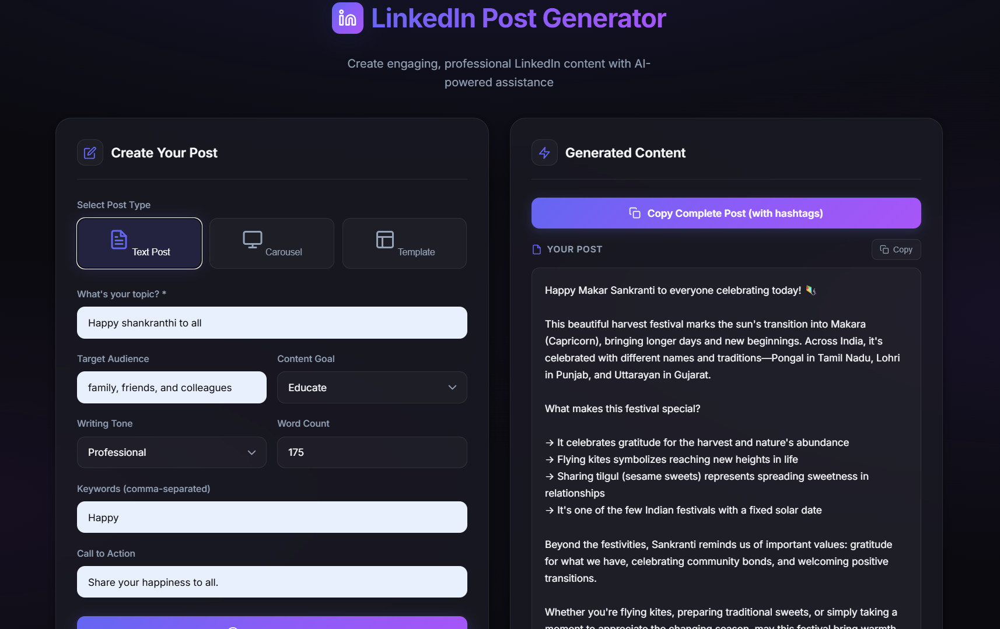
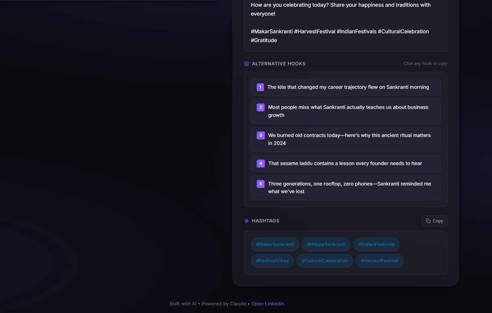
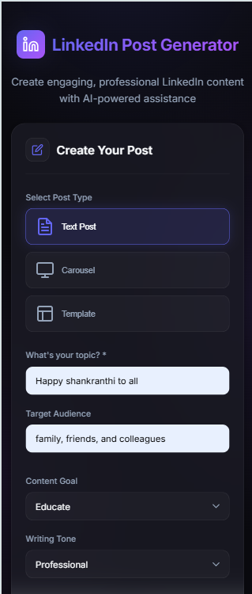
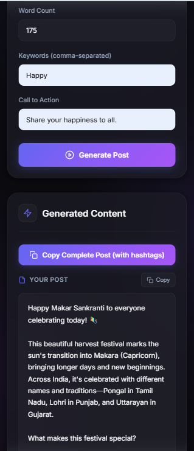
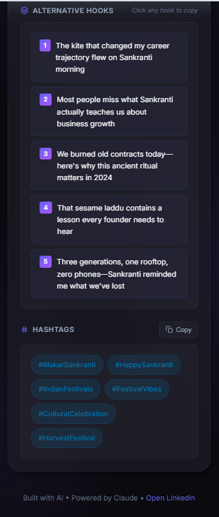

# LinkedIn Post Generator

An AI-powered web application that generates professional, engaging LinkedIn content. Create text posts, carousels, and use pre-built templates to streamline your content creation workflow.


## Live Demo

[View Live App](https://linkedin-post-generator.vercel.app) *(Update with your Vercel URL)*

## Features

- **Text Post Generation** - Create LinkedIn-ready posts with customizable tone, audience, and goals
- **Hook Generator** - Get 5 attention-grabbing opening lines optimized for LinkedIn's "See more" cutoff
- **Hashtag Suggestions** - AI-generated relevant hashtags (mix of broad and niche)
- **Carousel Creator** - Generate multi-slide content for LinkedIn carousels
- **Post Templates** - Pre-built frameworks for personal stories, lists, results breakdowns, and hot takes
- **Copy-to-Clipboard** - One-click copying for seamless posting to LinkedIn
- **Responsive UI** - Modern dark-themed interface that works on desktop and mobile

## Screenshots

<p align="center">
  
  
</p>

<p align="center">
  
  
  
</p>

## Deploy Your Own

### Deploy to Vercel

1. Fork this repository
2. Import to [Vercel](https://vercel.com/new)
3. Add environment variable:
   - `OPENROUTER_API_KEY` = your OpenRouter API key
4. Deploy!

[](https://vercel.com/new/clone?repository-url=https://github.com/LEKKALAGANESH/LinkedIn_Post_Generator)

### Run Locally

1. **Clone the repository**
   ```bash
   git clone https://github.com/LEKKALAGANESH/LinkedIn_Post_Generator.git
   cd LinkedIn_Post_Generator
   ```

2. **Install dependencies**
   ```bash
   pip install -r requirements.txt
   ```

3. **Set environment variable**
   ```bash
   export OPENROUTER_API_KEY=your_api_key_here
   ```

4. **Run the app**
   ```bash
   cd api && python index.py
   ```

5. Open `http://localhost:5000`

## Usage

1. Select your post type: **Text Post**, **Carousel**, or **Template**
2. Enter your topic and customize options (audience, tone, goal, etc.)
3. Click **Generate Post**
4. Copy the generated content directly to LinkedIn

## Project Structure

```
linkedin-post-generator/
├── api/
│   └── index.py          # Serverless function (Flask app)
├── templates/
│   └── index.html        # UI template (used locally)
├── docs/                  # Screenshots
├── requirements.txt       # Python dependencies
├── vercel.json           # Vercel configuration
└── README.md
```

## Configuration Options

| Option | Description | Default |
|--------|-------------|---------|
| Topic | Main subject of the post | Required |
| Audience | Target readers (e.g., "startup founders") | professionals |
| Goal | Content objective: educate, engage, inspire, convert | educate |
| Tone | Writing style: professional, casual, inspirational, conversational, authoritative | professional |
| Length | Approximate word count (50-500) | 150 |
| Keywords | Comma-separated terms to include | - |
| CTA | Call-to-action prompt | - |

## Available Templates

| Template | Description |
|----------|-------------|
| Personal Story | Share a failure that became a lesson |
| Mini List | 5 quick tips with actionable takeaways |
| Results Breakdown | Share metrics and data-driven insights |
| Hot Take | Controversial opinion with reasoning |

## API Endpoints

| Endpoint | Method | Description |
|----------|--------|-------------|
| `/` | GET | Web interface |
| `/generate` | POST | Generate content |
| `/templates` | GET | List available templates |

## Tech Stack

- **Runtime**: Python 3.10+ on Vercel Serverless
- **Framework**: Flask
- **AI Model**: Claude Sonnet 4.5 (via OpenRouter)
- **Frontend**: Vanilla HTML/CSS/JavaScript
- **Deployment**: Vercel

## Environment Variables

| Variable | Description |
|----------|-------------|
| `OPENROUTER_API_KEY` | Your OpenRouter API key ([Get one here](https://openrouter.ai/)) |

## License

This project is for personal and educational use.

## Author

**Ganesh Lekkala** - [GitHub](https://github.com/LEKKALAGANESH)
